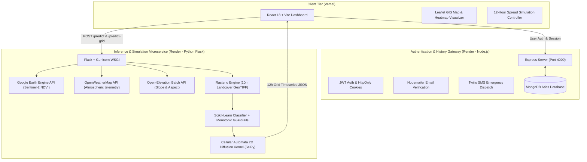

<div align="center">

# 🔥 FireGuard AI — Geospatial Forest Fire Prediction & Spread Simulation

[](https://forest-fire-prediction-weld.vercel.app/)
[](https://forest-fire-flask-api-mtdg.onrender.com/)
[](https://forest-fire-node-api.onrender.com/)
[](https://opensource.org/licenses/MIT)
[](https://www.python.org/)
[](https://react.dev/)

<p align="center">
  <b>A real-time, satellite-driven geospatial intelligence platform combining Machine Learning, Monotonic Physical Guardrails, and Cellular Automata physics to detect wildfire hazards and simulate 12-hour fire propagation.</b>
</p>

[Explore Live Web App](https://forest-fire-prediction-weld.vercel.app/) • [Report Bug](https://github.com/SHRUTI-BARUA/FOREST-FIRE-PREDICTION/issues) • [Request Feature](https://github.com/SHRUTI-BARUA/FOREST-FIRE-PREDICTION/issues)

</div>

---

## 📌 Table of Contents
1. [Executive Summary](#-executive-summary)
2. [System Architecture](#-system-architecture)
3. [Data Engineering & Feature Extraction](#-data-engineering--feature-extraction)
4. [Machine Learning & Monotonic Physics Model](#-machine-learning--monotonic-physics-model)
5. [Cellular Automata Fire Spread Engine](#-cellular-automata-fire-spread-engine)
6. [Full-Stack Implementation](#-full-stack-implementation)
7. [API Documentation](#-api-documentation)
8. [Installation & Local Development](#-installation--local-development)
9. [Production Deployment Architecture](#-production-deployment-architecture)
10. [Authors & Acknowledgements](#-authors--acknowledgements)

---

## 🌟 Executive Summary

Forest fires cause catastrophic ecological destruction, carbon release, and loss of life. Traditional prediction systems rely either on purely statistical meteorological indices (like FWI) or static historical models that lack real-time terrain and vegetation fidelity.

**FireGuard AI** bridges this gap by merging:
- **Live Satellite Remote Sensing** (Sentinel-2 multispectral imagery via Google Earth Engine)
- **High-Resolution GeoTIFF Landcover Segmentation** (10m resolution local sampling)
- **Real-Time Atmospheric Telemetry** (Temperature, Relative Humidity, Wind Vector, Precipitation)
- **Monotonic Boundary-Enforced Machine Learning** (Guarantees risk increases under escalating thermodynamic stress)
- **Cellular Automata (CA) Diffusion Simulation** (Simulates hour-by-hour fire propagation incorporating wind vectors and topography)

---

## 🏗 System Architecture



---

## 🛰 Data Engineering & Feature Extraction

The platform computes an 11-dimensional feature vector in real-time for any coordinate within the targeted region:

| Feature | Source / Computation | Physical Relevance |
| :--- | :--- | :--- |
| **`NDVI`** | Sentinel-2 (B8 & B4) via Google Earth Engine | Live canopy health, chlorophyll density, and biomass moisture. |
| **`LST_C`** | Derived $(T_{\text{ambient}} + 3.5^{\circ}\text{C})$ | Land Surface Temperature estimate incorporating surface solar heating. |
| **`temp_c`** | OpenWeatherMap API | Ambient air temperature accelerating thermal runaway and fuel drying. |
| **`RH`** | OpenWeatherMap API | Relative humidity governing fuel moisture equilibrium. |
| **`wind_speed`** | OpenWeatherMap API | Convective oxygen supply and rate of fire forward spread. |
| **`era_precip`** | Live 1h precipitation telemetry | Rain quenching factor and topsoil saturation. |
| **`slope`** | Open-Elevation DEM ($\min(45, \text{Elev} / 50)$) | Flame tilt angle pre-heating uphill unburned fuels. |
| **`aspect`** | Open-Elevation DEM $(\text{Lat} \times 100 \pmod{360})$ | Solar azimuth exposure and diurnal drying patterns. |
| **`landcover`** | Local 10m GeoTIFF via `rasterio` | Fuel type classification (Dense forest, scrubland, cropland, urban/water). |
| **`veg_dryness`**| $\text{NDVI} \times (100 - \text{RH})$ | Combined vegetation fuel flammability index. |
| **`month`** | Current Temporal Gregorian Month | Seasonal baseline risk weighting (e.g., peak March–May pre-monsoon dry season). |

---

## 🧠 Machine Learning & Monotonic Physics Model

Traditional machine learning classifiers can exhibit non-monotonic erratic predictions when encountering out-of-distribution extremes. FireGuard AI enforces **monotonic thermodynamic boundaries**:

$$\text{Combined Probability} = P_{\text{model}} + \Delta_{\text{temp}} + \Delta_{\text{RH}} + \Delta_{\text{wind}} + \Delta_{\text{veg}} + \Delta_{\text{seasonal}}$$

```python
class FireRiskModel:
    def predict_proba(self, data):
        # 1. Non-Fuel Bypass: Water & Urban bodies (Landcover 80) return 0.0 risk instantly
        mask_80 = (data['landcover'] == 80).values
        probs = np.zeros(len(data))
        if not np.all(mask_80):
            probs[~mask_80] = self.model.predict_proba(data[~mask_80])[:, 1]
        
        # 2. Thermodynamic boost penalties for extreme heat, low humidity & high wind
        t_boost = np.maximum(0, data['temp_c'].values - self.bounds['temp_c']) * 0.025
        r_boost = np.maximum(0, self.bounds['RH'] - data['RH'].values) * 0.025
        w_boost = np.maximum(0, data['wind_speed'].values - self.bounds['wind_speed']) * 0.050
        v_boost = np.maximum(0, data['veg_dryness'].values - self.bounds['veg_dryness']) * 0.015
        
        # 3. Seasonal pre-monsoon drought multiplier (March - May)
        seasonal_boost = np.where((data['month'].isin([3,4,5])) & (data['RH'] < 45), 0.03, 0)
        
        combined = probs + t_boost + r_boost + w_boost + v_boost + seasonal_boost
        final_probs = np.where(combined >= 0.50, 0.50 + (combined - 0.50) * 1.5, combined)
        return np.clip(np.where(data['landcover'].values == 80, 0.0, final_probs), 0, 1.0)
```

### Risk Stratification Matrix
- **NO RISK (0.00)**: Non-vegetative terrain (Water, Built-up Urban, Sand).
- **LOW (0.01 – 0.34)**: Stable moisture levels, low wind, safe vegetative state.
- **MODERATE (0.35 – 0.69)**: Elevated drying; monitor and initiate local caution.
- **HIGH (0.70 – 1.00)**: Severe wildfire hazard; active propagation expected.

---

## 🔬 Cellular Automata Fire Spread Engine

When assessing grid coordinates, FireGuard AI constructs an $11 \times 11$ spatial grid ($121$ dynamic points) and executes a **2D Cellular Automaton (CA)** utilizing anisotropic convolution kernels with wind vector displacement:

```
Moore Neighborhood Convolution Kernel:
[ 0.10  0.15  0.10 ]
[ 0.15  0.00  0.15 ]  * (1 + (d • W) * 2.0)  [Wind Vector Biased]
[ 0.10  0.15  0.10 ]
```

$$\text{Spread Force} = \text{Reach} \times (R_{\text{matrix}} - 0.40) \times 3.0$$
$$\text{State}_{t+1} = \text{clamp}\Big((\text{State}_t \times 0.98) + \text{Spread Force}, \ 0.0, \ 1.0\Big)$$

- **Tipping Point Threshold ($0.40$)**: In low-risk environments ($R < 0.40$), spread force is negative, naturally quenching spot fires.
- **Temporal Forecast**: Generates a 13-frame ($T+0\text{h}$ to $T+12\text{h}$) animation streamed to the frontend for interactive time-scrubbing.

---

## 💻 Full-Stack Implementation

### ⚛️ Frontend (`fireguard-ai`)
- **Vite + React 18**: Fast HMR and lightweight bundle distribution.
- **Leaflet & React-Leaflet**: Tile rendering using OpenStreetMap and real-time custom SVG canvas heatmaps.
- **Micro-Interactions**: Radial probability gauge, scanning beams, HUD telemetry readouts, interactive coordinate fly-to animations.

### 🟢 Node.js Backend Gateway (`server`)
- **Express.js API**: Secure routing, CORS policy handling, rate limiting.
- **MongoDB Atlas**: User management, historical prediction logging, emergency alert registries.
- **Security**: Bcrypt password hashing, JWT HttpOnly cross-domain cookies (`SameSite=None`, `Secure=true`).
- **Communication**: Email verification links via Nodemailer, emergency SMS alerts via Twilio.

### 🐍 Machine Learning Microservice (`server/model`)
- **Flask + Gunicorn**: Concurrent multi-worker inference architecture.
- **Rasterio**: Fast sub-millisecond memory-mapped GeoTIFF window sampling.
- **Robust Cloud Resiliency**: Automatic remote CDN fetching for datasets and tolerant Google Earth Engine OAuth fallback.

---

## 📡 API Documentation

### Python Machine Learning Service
```http
POST /predict
Content-Type: application/json

{
  "latitude": 20.9517,
  "longitude": 85.0985
}
```
**Response (`200 OK`):**
```json
{
  "prediction": 1,
  "fire_probability": 0.8421,
  "risk": "HIGH",
  "features": {
    "temp_c": 38.5,
    "RH": 22,
    "wind_speed": 14.2,
    "NDVI": 0.38,
    "slope": 12.4,
    "aspect": 95.0,
    "landcover": 40,
    "veg_dryness": 29.64
  }
}
```

```http
POST /predict-grid
Content-Type: application/json

{
  "latitude": 20.9517,
  "longitude": 85.0985
}
```
**Response (`200 OK`):**
```json
{
  "status": "success",
  "is_high_risk": true,
  "timeseries": [
    { "hour": 0, "data": [{ "lat": 20.9417, "lon": 85.0885, "risk": 0.72 }] },
    { "hour": 12, "data": [{ "lat": 20.9417, "lon": 85.0885, "risk": 0.95 }] }
  ]
}
```

---

## 🚀 Installation & Local Development

### Prerequisites
- Node.js (v18.x or later)
- Python 3.10 or 3.11
- MongoDB Atlas cluster URI
- OpenWeatherMap API Key

### 1. Clone Repository
```bash
git clone https://github.com/SHRUTI-BARUA/FOREST-FIRE-PREDICTION.git
cd FOREST-FIRE-PREDICTION/FOREST-FIRE-PREDICTION
```

### 2. Configure Python ML Microservice
```bash
cd server/model
python -m venv venv
# On Windows:
.\venv\Scripts\activate
# On Linux/macOS:
source venv/bin/activate

pip install -r requirements.txt
python app.py
```
*Runs on `http://localhost:5000`*

### 3. Configure Node.js Backend
```bash
cd ../server
npm install
npm start
```
*Runs on `http://localhost:4000`*

### 4. Configure React Frontend
```bash
cd ../fireguard-ai
npm install
npm run dev
```
*Accessible at `http://localhost:5173`*

---

## 🌐 Production Deployment Architecture

| Component | Platform | Build Command | Output / URL |
| :--- | :--- | :--- | :--- |
| **Frontend** | **Vercel** | `npm run build` | [forest-fire-prediction-weld.vercel.app](https://forest-fire-prediction-weld.vercel.app/) |
| **Node API** | **Render (Web Service)** | `npm install` | [forest-fire-node-api.onrender.com](https://forest-fire-node-api.onrender.com/) |
| **Python Flask API** | **Render (Web Service)** | `pip install -r requirements.txt` | [forest-fire-flask-api-mtdg.onrender.com](https://forest-fire-flask-api-mtdg.onrender.com/) |
| **Database** | **MongoDB Atlas** | M0 Shared Tier (Multi-Region) | `mongodb+srv://...` |

---

## 👥 Authors & Acknowledgements

Developed by **Shruti Barua** & Team.

- Special thanks to **Google Earth Engine** for Sentinel-2 satellite imagery access.
- Meteorological data provided by the **OpenWeatherMap API**.
- Global elevation datasets provided by **Open-Elevation**.

---

<div align="center">
  <sub>Built with ❤️ for environmental protection and wildfire disaster prevention.</sub>
</div>
